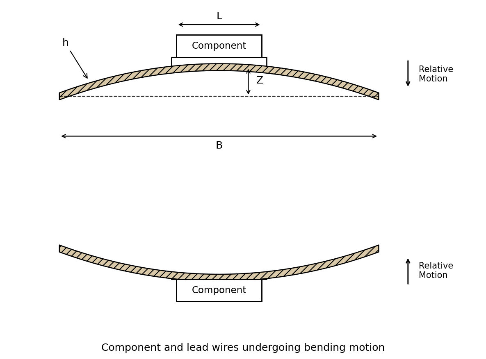
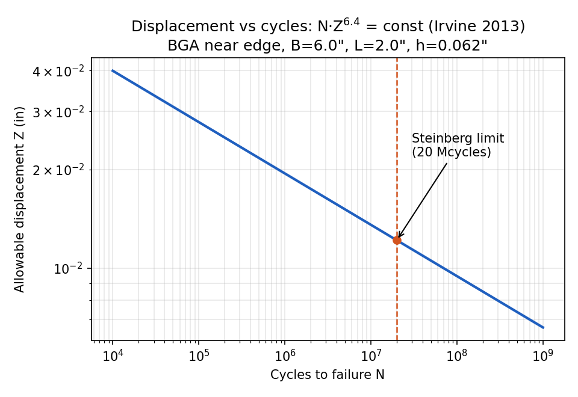

# 3σ Steinberg Limit

<p align="center">

</p>

Calculators for **Steinberg's relative displacement limits** of
circuit-board components — the classic check for whether a PCB-mounted
component survives 20 million stress cycles in random vibration or a shock
event. Three interfaces share the same constants and formulas: a
**web calculator** (no install, runs on GitHub Pages), a **Python GUI**,
and a **command line / importable module**. The original Excel workbook is
included for reference.

## The limits

For a component of length $L$ mounted on a board of thickness $h$, on the
edge of length $B$ parallel to the component:

```math
Z_{3\sigma} = \frac{0.00022\,B}{C\,h\,r\,\sqrt{L}} \quad \text{(random vibration)}
\qquad\qquad
Z_{peak} = \frac{0.00132\,B}{C\,h\,r\,\sqrt{L}} \quad \text{(shock)}
```

All lengths in inches. If the board's expected relative displacement stays
below the limit, the component's solder joints and lead wires are expected
to survive 20 million cycles.

### Relative position factor r

`r` measures where the component sits relative to the board center, where
curvature (and therefore relative displacement) is largest:

| Position | r |
|---|---|
| Center of PCB | 1.0 |
| Half point X, quarter point Y (near an edge) | 0.707 |
| Quarter point X and Y (near a corner) | 0.5 |
| Not sure | 1.0 (conservative) |

### Component constant C

| Component type | C |
|---|---|
| Resistors, capacitors, diodes | 0.75 |
| Standard DIP | 1.00 |
| DIP with side-brazed lead wires | 1.26 |
| Through-hole PGA | 1.00 |
| Surface-mounted LCCC | 2.25 |
| Surface-mounted chip carrier, J / gull-wing wires | 1.26 |
| Surface-mounted BGA | 1.75 |
| Fine-pitch surface-mounted axial leads | 0.75 |
| Two parallel rows of wires (hybrid, PGA, VLSI, ASIC, VHSIC, MCM) | 1.26 |
| Not sure | 2.25 (conservative) |

Larger C (stiffer, less compliant attachment) and larger r (closer to the
board center) both *shrink* the allowable displacement, so the
conservative defaults are C = 2.25 and r = 1.

## Use it

**Web (recommended):** open the GitHub Pages site for this repository —
dropdowns for C and r, live results in inches and mm. Nothing to install.

**Python GUI:**

```bash
python steinberg_gui.py
```

**Command line:**

```bash
python steinberg.py -B 6 -L 2 -t 0.062 -C 1.75 -r 0.707
```

**As a module:**

```python
from steinberg import z_limits, COMPONENT_C, POSITION_R
zv, zs = z_limits(B=6, L=2, h=0.062, C=1.75, r=0.707)
```

The Python module reproduces the included Excel workbook
(`excel/3_sigma_Steinberg.xlsx`) exactly.

## Beyond the 20-Mcycle point

**Irvine's fatigue-curve extension.** The vibration limit above is the
single point at 20 million cycles. Irvine (2013) extends it to a full
displacement-vs-cycles curve through the fatigue relation

```math
N \cdot Z^{6.4} = \text{const}
\qquad\Longrightarrow\qquad
Z(N) = Z_{3\sigma}\left(\frac{2\times 10^{7}}{N}\right)^{1/6.4}
```

so a design life other than 20 Mcycles rescales the allowable
displacement. Both calculators accept the cycle count; the module exposes
`z_limit_at_cycles(N, ...)`.

<p align="center">

</p>

**Margin of safety.** The limit is only half of the check — the other half
is the displacement the board actually sees. Given the board natural
frequency $f_n$, the input PSD $P$ at $f_n$, and transmissibility $Q$
(Steinberg's estimate $Q = \sqrt{f_n}$ when unknown), Miles' equation
gives the response and the expected 3σ displacement:

```math
G_{rms} = \sqrt{\tfrac{\pi}{2} P f_n Q}
\qquad
Z_{3\sigma}^{exp} = \frac{3 \times 9.8\, G_{rms}}{f_n^2}
\qquad
Z_{shock}^{exp} = \frac{9.8\, G_{peak}}{f_n^2}
```

(inches, $f_n$ in Hz). The margin of safety is
$\text{MoS} = Z_{limit}/Z_{exp} - 1$, with $\text{MoS} \ge 0$ passing.
Both calculators report it when the optional inputs are provided
(`expected_z_random`, `expected_z_shock`, `margin` in the module).

## References

1. D. S. Steinberg, *Vibration Analysis for Electronic Equipment*,
   3rd ed., John Wiley & Sons, 2000.
2. T. Irvine, "Extending Steinberg's Fatigue Analysis of Electronics
   Equipment Methodology to a Full Relative Displacement vs. Cycles
   Curve," pp. 1–29, 2013.

## License

MIT — see [LICENSE](LICENSE).
